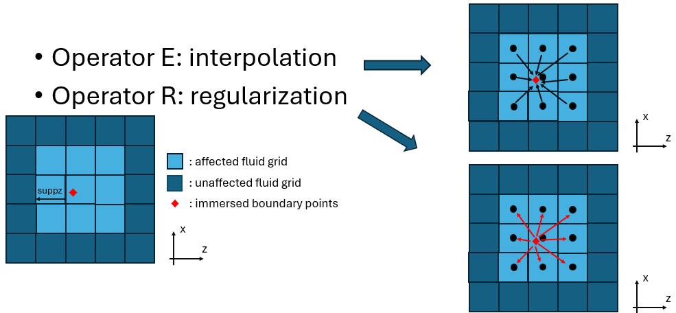
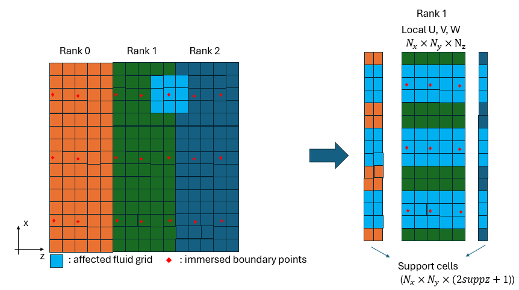
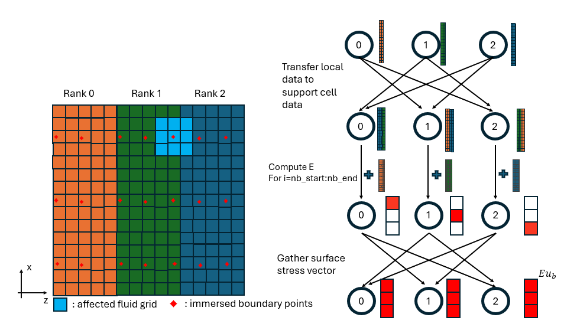
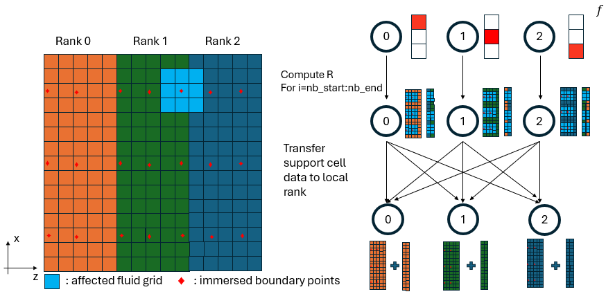

# Interpolation and Regularization Operators with MPI


*Figure 1: Schematic of interpolation and regularization operator.*

In the Immersed Boundary Projection Method (IBPM), two operators link the
fluid grid and the immersed boundary (IB) points:

- **Operator E** (interpolation, `regT`): interpolates fluid velocity from
  the Eulerian grid onto the Lagrangian IB points
- **Operator R** (regularization, `regu`/`regv`/`regw`): spreads the IB
  force from the Lagrangian IB points back onto the Eulerian grid

Each IB point interacts with a local stencil of fluid grid points within a
support radius `suppz` in the spanwise direction (and equivalently in x
and y). The affected fluid cells are illustrated in the schematics above.

---

## The Support Cell Concept


*Figure 2: Schematic of support cell.*

Because the domain is partitioned along z, an IB point near a rank
boundary may require fluid data that lives on a **neighboring rank**. To
handle this without repeated point-to-point communication during the
operator evaluation, each rank maintains a support cell buffer, called **support cell**, a local
copy of the fluid planes from neighboring ranks that fall within the stencil
of its assigned IB points.

The support cell buffer for each variable has size:
```
N_x × N_y × (2·suppz + 1)
```

where `2·suppz + 1` is the full stencil width in z. The subroutines
`interior_planes_update_support` and `support_update_interior_planes`
handle the MPI communication to keep these buffers synchronized before and
after the operator evaluations.

---

## IB Point Distribution Across Ranks

Each rank is responsible for a contiguous subset of the `nb` total IB points,
defined by the range `[nb_start, nb_end]`. The local number of IB points is:
```fortran
local_size_nb = nb_end - nb_start + 1
```

---

## Operator E — Interpolation (`regT`)

*Figure 2: Flow chart of interpolation operator.*

The interpolation operator evaluates the fluid velocity at each IB point as
a weighted sum over the surrounding stencil points:

$$E\mathbf{u} = \sum_{i=1}^{N_{\text{weights}}} w_i \, \mathbf{u}(\mathbf{x}_i)$$

### Execution Steps

**Step 1 — Populate support cells:**
```fortran
Call interior_planes_update_support(U_, U_supp, 1)
Call interior_planes_update_support(V_, V_supp, 2)
Call interior_planes_update_support(W_, W_supp, 3)
```

Fluid planes from neighboring ranks that fall within the stencil are copied
into the local support buffers `U_supp`, `V_supp`, `W_supp`.

**Step 2 — Local interpolation (`local_regT`):**

For each IB point `j` in `[nb_start, nb_end]` and each stencil point `i`:
```fortran
! If the stencil point lives on myid → read from local array
Eu_(j) = Eu_(j) + u_weights(i,j) * U_(xi, yi, z_local)

! If the stencil point lives on a neighbor → read from support buffer
Eu_(j) = Eu_(j) + u_weights(i,j) * U_supp_(xi, yi, z_supp)
```

The rank that owns a given stencil point is stored in `u_proc(i,j)` (and
equivalently `v_proc`, `w_proc`).

**Step 3 — Global assembly (`MPI_Allgatherv`):**

Each rank has computed the interpolated value only for its assigned IB
points. A global gather assembles the full result across all ranks,
separately for each velocity component:
```fortran
! Gather u-component: indices 1      .. nb
Call MPI_Allgatherv(regT_buffer(nb_start     : nb_end),     ...)

! Gather v-component: indices nb+1   .. 2*nb
Call MPI_Allgatherv(regT_buffer(nb+nb_start  : nb+nb_end),  ...)

! Gather w-component: indices 2*nb+1 .. 3*nb
Call MPI_Allgatherv(regT_buffer(2*nb+nb_start: 2*nb+nb_end), ...)
```

After this step every rank holds the complete interpolated vector `Eu_` of
length `3·nb`.

---

## Operator R — Regularization (`regu` / `regv` / `regw`)

*Figure 2: Flow chart of regularization operator.*

The regularization operator spreads the IB body force back onto the fluid
grid as a weighted sum scaled by the cell volume:

$$R\mathbf{f} = \sum_{j=1}^{N_b} w_j \, \frac{s_j}{\Delta x \, \Delta y_{\min} \, \Delta z} \, f_j \, \delta(\mathbf{x} - \mathbf{x}_j)$$

### Execution Steps

**Step 1 — Local regularization (`local_reg`):**

For each IB point `j` in `[nb_start, nb_end]` and each stencil point `i`,
the body force is accumulated onto the fluid grid:
```fortran
! If the stencil point lives on myid → write directly into F
F(xi, yi, z_local) = F(xi, yi, z_local) + weight * factor * sb(j) * f_(j)

! If the stencil point lives on a neighbor → write into support buffer
F_supp(xi, yi, z_supp) = F_supp(xi, yi, z_supp) + weight * factor * sb(j) * f_(j)
```

where `factor = 1 / (dx · dy_min · dz)` and `sb(j)` is the arc-length
weight of IB point `j`.

**Step 2 — Reduce support buffer back to interior planes:**
```fortran
Call support_update_interior_planes(F, F_supp, id)
```

Contributions that were accumulated in the support buffer (targeting
neighboring ranks) are sent back and added into those ranks' interior
arrays, completing the scatter operation.

---

## Summary

| Step | Operator E (`regT`) | Operator R (`regu`/`regv`/`regw`) |
|------|---------------------|------------------------------------|
| Pre-communication  | `interior_planes_update_support` | — |
| Local computation  | `local_regT` | `local_reg` |
| Post-communication | `MPI_Allgatherv` | `support_update_interior_planes` |