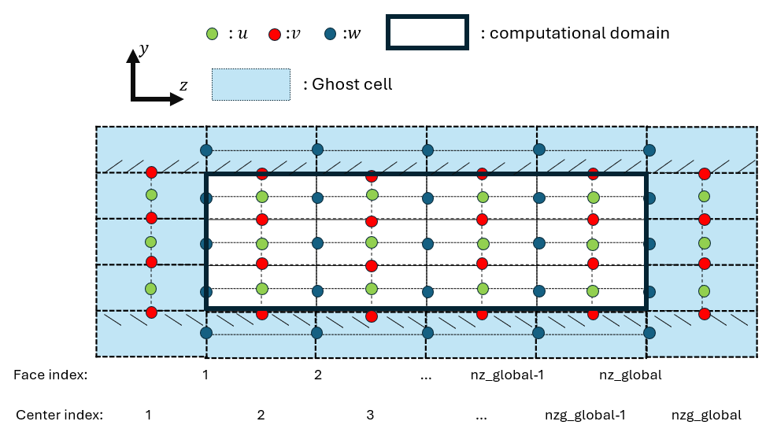

# Global Index and Local Index Rule for MPI Code

In the fully-coupled FMI code, a **staggered grid arrangement** is adopted to improve numerical
stability and enforce the incompressibility constraint. In this layout, different flow variables
are stored at different spatial locations within each control volume.

## Schematic Overview



*Figure 1: Illustration of staggered grid indexing and ghost-cell layout in the wall-normal direction.*

| Symbol | Quantity |
|--------|----------|
| Green dots | Streamwise velocity u |
| Red dots | Wall-normal velocity v |
| Blue dots | Spanwise velocity w |
| Solid black line | Computational domain |
| light blue region | Ghost cells |

---

## Staggered Grid Arrangement

In a staggered grid:

- **Scalar quantities** (e.g., pressure $p$) are stored at **cell centers**
- **Velocity components** are stored at corresponding **cell faces**:

| Variable | Direction | Storage Location |
|----------|-----------|-----------------|
| u | Streamwise | Streamwise faces |
| v | Wall-normal | Wall-normal faces |
| w | Spanwise | Spanwise faces |

This arrangement avoids pressure–velocity decoupling and improves numerical robustness.
Since the MPI partition is performed in the spanwise direction (z), the index conventions
below focus on the z direction.

---

## Global Indexing in the Spanwise Direction (z)

### Face Index — Spanwise Velocity w

Spanwise velocity w is located on **cell faces** and uses the **face index**:
```
k = 1, 2, 3, ..., nz_global
```

### Center Index — Streamwise u and Wall-normal v Velocities

Streamwise velocity $u$ and wall-normal velocity $v$ are located at **cell centers**
and use the **center index**:
```
k = 1, 2, 3, ..., nzg_global
```

`nzg_global` denotes the total number of cell centers in the spanwise direction globally,
while `nz_global` denotes the total number of cell faces. In general, `nzg_global = nz_global + 1`
    when ghost cells are accounted for — confirm with your domain setup.

## MPI Partitioning in the Spanwise Direction

The domain is decomposed along the spanwise ($z$) direction across `nprocs` MPI ranks
(indexed `0` to `nprocs-1`). The decomposition is based on the number of
**interior spanwise slices per rank**:
```fortran
nslices_z = (nz_global - 2) / nprocs
```

The two boundary planes (`k=1` and `k=nz_global`) are excluded from the
even split, hence the `nz_global - 2` term. Each rank therefore owns
`nslices_z` interior planes, plus ghost cells on each side.

---

### Global Index Ranges per Rank

For each rank `i`, the global start and end indices are defined as:

**Face index** (spanwise velocity $w$, defined on $z$-faces):
```fortran
k1_global(i)  = i * nslices_z + 1
k2_global(i)  = k1_global(i) + nslices_z + 1
```

**Center index** (velocities $u$, $v$ and scalar $c$, defined on $z$-centers):
```fortran
kg1_global(i) = i * nslices_z + 1
kg2_global(i) = kg1_global(i) + nslices_z + 1
```

!!! note
    The last rank is extended to absorb any remainder from the global domain:
```fortran
    k2_global (nprocs-1) = nz_global
    kg2_global(nprocs-1) = nz_global + 1
```

---

### Local Array Size

From the global ranges, each rank computes its local array sizes:

**Face-based** (w):
```fortran
nz  = k2_global(myid) - k1_global(myid) + 1   ! = nslices_z + 2
```

**Center-based** (u,v,c):
```fortran
nzg = kg2_global(myid) - kg1_global(myid) + 1  ! = nslices_z + 2
nzm = nzg - 2                                   ! interior centers only
```

Both `nz` and `nzg` equal `nslices_z + 2`, where the extra 2 accounts for
**one ghost cell layer on each side** of the local slab.

---

### Ghost Cell Overlap Between Ranks

The `+1` offset in `k2_global` and `kg2_global` causes adjacent ranks to
**overlap by two global planes**, forming the ghost cell regions:
```
Global k:   1    2    3  ...  k2(i)-1   k2(i)   k1(i+1)   k1(i+1)+1  ...

            ├────────────────────────────────┤
Rank i:     k1(i)                        k2(i)
                                         ghost ──►
                              ◄── ghost
                                    ├────────────────────────────────┤
Rank i+1:                         k1(i+1)                        k2(i+1)
```

Concretely, for a domain with `nz_global=10` and `nprocs=2` (`nslices_z=4`):

| Rank | `k1_global` | `k2_global` | Global planes owned | Local index `k` |
|------|-------------|-------------|----------------------|-----------------|
| 0    | 1           | 6           | 1 – 6                | 1 – 6           |
| 1    | 5           | 10          | 5 – 10               | 1 – 6           |

Global planes `5` and `6` are owned by both ranks — plane `6` of rank 0 is
the **upper ghost** (`k = nz`), and plane `5` of rank 1 is the **lower ghost**
(`k = 1`).

The mapping between local and global indices is:
```fortran
k_global = k1_global(myid) + k_local - 1
k_local  = k_global - k1_global(myid) + 1
```

---

### Ghost Cell Update and Periodic BC

Ghost cells are kept up to date by two subroutines in the source file `boundary_condition.f90`:

- **`update_ghost_interior_planes(F, id)`** — exchanges the overlapping ghost
  planes between neighboring ranks after each time step.
- **`apply_periodic_bc_z(F, id)`** — enforces spanwise periodicity by
  wrapping data between rank `0` and rank `nprocs-1`.