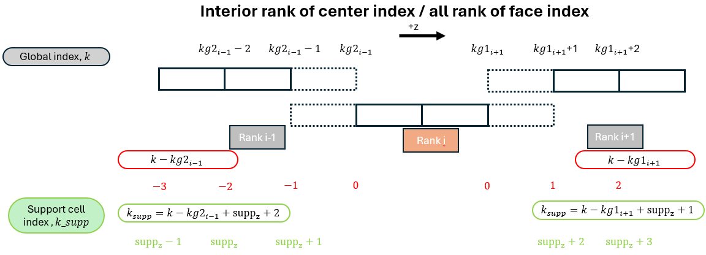
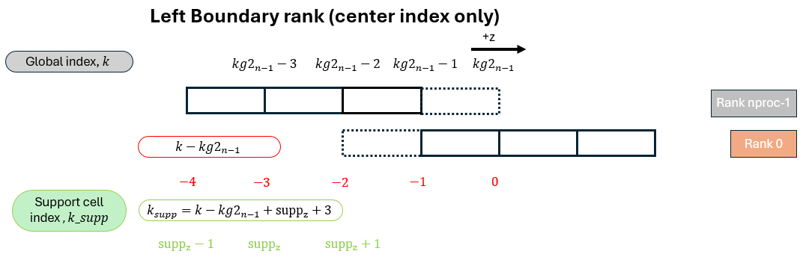
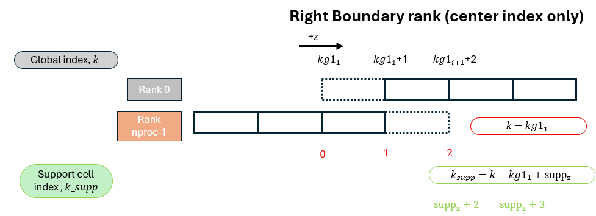

## Support Cell Index Definition

Each IB stencil point has a global index \(k\) in the spanwise direction.
Before evaluating the interpolation or regularization operators, this global
index must be mapped to either a **local index** `k_loc` (if the point lives
on `myid`) or a **support cell index** `k_sup` (if the point lives on a
neighboring rank). This section documents that mapping for both face-based
(\(w\)) and center-based (\(u\), \(v\), \(c\)) variables.

The two subroutines that implement this mapping are:

- `global_to_local_face(k_global, k_sup, k_loc, rank)` — for \(w\) (face index)
- `global_to_local_center(k_global, k_sup, k_loc, rank)` — for \(u\), \(v\), \(c\) (center index)

Both return the same three outputs:

| Output | Meaning |
|--------|---------|
| `rank` | The rank that owns `k_global` (`myid`, `prev`, or `next`) |
| `k_loc` | Local array index in `F(:,:,k_loc)` — valid only when `rank == myid` |
| `k_sup` | Support buffer index in `F_supp(:,:,k_sup)` — valid only when `rank /= myid` |

The support buffer on each rank has size `2*suppz+1` in the \(z\) direction,
storing `suppz` planes from the left neighbor followed by `suppz+1` planes
from the right neighbor (or vice versa depending on context).

---

### Support Buffer Layout Summary

For any rank `myid`, the support buffer `F_supp(:,:, 1:2*suppz+1)` is
organized as follows:
```
Index in F_supp:   1        ...   suppz+1  |  suppz+2   ...   2*suppz+1
                   ◄── from left neighbor ──┤──── from right neighbor ──►
                   (rank prev / nprocs-1)   │   (rank next / rank 0)
```

A global index outside the range `[1, 2*suppz+1]` after the mapping is a
fatal error, caught by both subroutines:
```fortran
if (k_sup < 1 .or. k_sup > 2*suppz+1) stop 'Error: zi_supp out of [1..suppz*2+1]'
```

---

### Case 1 — Interior Rank for center index / All rank for face index

This case applies to:

- **All ranks** for the **face index** (`global_to_local_face`)
- **Interior ranks** (`0 < myid < nprocs-1`) for the **center index** (`global_to_local_center`)



For rank \(i\), the neighboring ranks are `prev = i-1` and `next = i+1`.
A global index \(k\) belonging to the **left neighbor** (rank \(i-1\)) maps to:

$$k_{\text{supp}} = k - kg2_{i-1} + \text{supp}_z + 2$$

which places it in the lower portion of the support buffer
(indices \(\text{supp}_z - 1\) to \(\text{supp}_z + 1\) as shown in the schematic).

A global index \(k\) belonging to the **right neighbor** (rank \(i+1\)) maps to:

$$k_{\text{supp}} = k - kg1_{i+1} + \text{supp}_z + 1$$

which places it in the upper portion of the support buffer
(indices \(\text{supp}_z + 2\) to \(\text{supp}_z + 3\)).

In code:
```fortran
! Left neighbor (rank == prev)
k_sup = k_global - kg2_global(prev) + suppz + 2

! Right neighbor (rank == next)
k_sup = k_global - kg1_global(next) + suppz + 1
```

The local index for a point owned by `myid` is simply:
```fortran
k_loc = k_global - kg1_global(myid) + 1
k_sup = -1   ! not used
```

---
### Periodic Boundary Condition and Center Index

Apart from the general interior rank case, special treatment is needed at
the domain boundaries to account for the periodic boundary condition. Since
the periodic condition for face-based variables (\(w\)) is handled identically
to the ghost cell treatment, only the **center index** special cases are
documented here.

The periodic boundary condition enforces the following equivalences for
center-based variables (taking \(u\) as an example):
```fortran
U(:,:,1) = U(:,:, nzg_global-2)  ! rank 0, local k=1 ← rank nprocs-1, local k=nzg-2
U(:,:,2) = U(:,:, nzg_global-1)  ! rank 0, local k=2 ← rank nprocs-1, local k=nzg-1
U(:,:,3) = U(:,:, nzg_global  )  ! rank 0, local k=3 ← rank nprocs-1, local k=nzg
```

This means that local index `k=2` on rank `0` holds the same physical value
as local index `k=nzg-1` on rank `nprocs-1`. As a result:

- **Rank `0`** (right neighbor to rank `nprocs-1`): when rank `nprocs-1`
  looks up data from rank `0`, the effective index must be shifted **one
  position to the left** relative to the interior formula, because the first
  meaningful plane of rank `0` starts one index later than a standard
  interior rank would.
- **Rank `nprocs-1`** (left neighbor to rank `0`): when rank `0` looks up
  data from rank `nprocs-1`, the effective index must be shifted **one
  position to the right**, because `k=nzg-1` at rank `nprocs-1` is
  physically equivalent to `k=2` at rank `0`.

!!! note "Special treatment for `k=2` and `k=nzg_global-1`"
    The planes at global index `k=2` (owned by rank `0`) and
    `k=nzg_global-1` (owned by rank `nprocs-1`) require special handling
    because they are periodic images of each other:

- **Regularization:** the contribution to these planes is computed as
      if the point is interior to rank `nprocs-1`. The result is then
      transferred to rank `0` and accumulated there. After the solve, the
      periodic boundary condition propagates the correct value back to rank
      `nprocs-1`, ensuring consistency.
- **Interpolation:** since the velocity field already satisfies the
      periodic boundary condition before the operator is applied, rank
      `nprocs-1` can read data directly from index `3+` in rank `0`
      without any additional correction.

---

### Case 2 — Right Boundary Rank Accessing Rank 0 (Periodic, Center Index Only)

This case applies to **rank `nprocs-1`** when it needs support cell data
from **rank `0`** (its right neighbor under the periodic boundary condition).



In the interior formula, the support index for a right neighbor is:

$$k_{\text{supp}} = k - kg1_{i+1} + \text{supp}_z + 1$$

However, because `k=2` on rank `0` is the periodic image of `k=nzg-1` on
rank `nprocs-1`, rank `0`'s effective interior starts one plane later than
a standard interior rank. The support index must therefore be shifted one
position to the left:

$$k_{\text{supp}} = k - kg1_{1} + \text{supp}_z$$

In code:
```fortran
! Right neighbor is rank 0 — apply periodic correction
k_sup = k_global - kg1_global(next) + suppz + 1
if (rank == 0) k_sup = k_sup - 1
```

---

### Case 3 — Left Boundary Rank Accessing Rank `nprocs-1` (Periodic, Center Index Only)

This case applies to **rank `0`** when it needs support cell data from
**rank `nprocs-1`** (its left neighbor under the periodic boundary condition).



In the interior formula, the support index for a left neighbor is:

$$k_{\text{supp}} = k - kg2_{i-1} + \text{supp}_z + 2$$

However, because `k=nzg-1` on rank `nprocs-1` is the periodic image of
`k=2` on rank `0`, the last meaningful plane of rank `nprocs-1` extends one
index further than a standard interior rank. The support index must therefore
be shifted one position to the right:

$$k_{\text{supp}} = k - kg2_{n-1} + \text{supp}_z + 3$$

In code:
```fortran
! Left neighbor is rank nprocs-1 — apply periodic correction
k_sup = k_global - kg2_global(prev) + suppz + 2
if (rank == nprocs-1) k_sup = k_sup + 1
```


