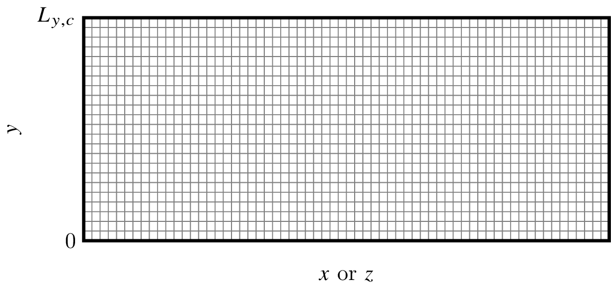
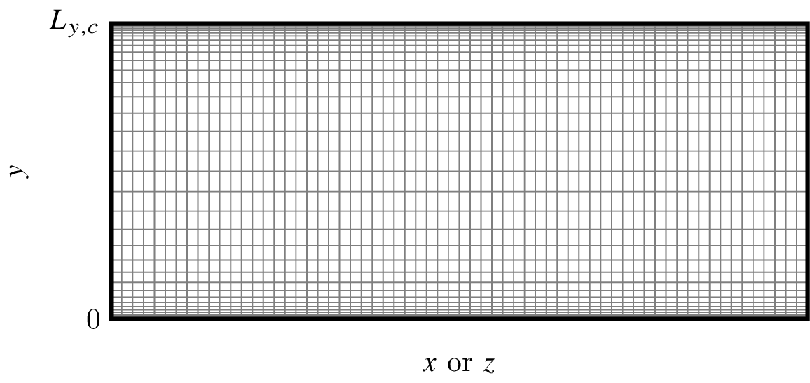
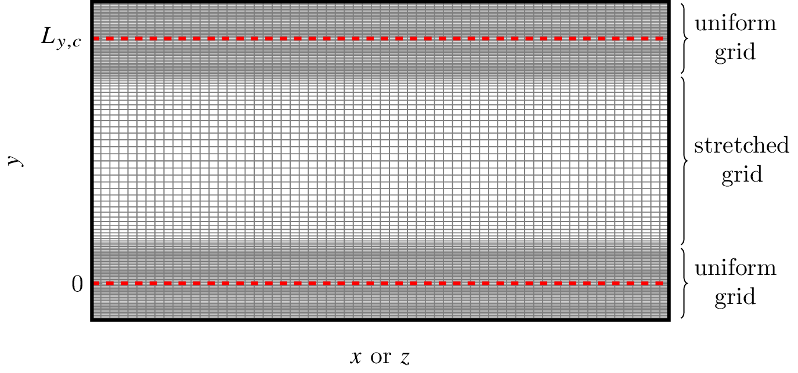

# Grid types

## Overview

The flow grid is uniform in the streamwise (x) and spanwise (z) directions. The spacing in those directions is:

$$ \Delta x = \frac{L_{x,p}}{N_x - 2} $$

$$ \Delta z = \frac{L_{z,p}}{N_z - 2} $$

where the parameters are the following:

| Variable  | Corresponding input parameter | Default Value | Description |
|-----------|-------------------------------|---------------|-------------|
| $L_{x,p}$ | `Lxp`                         | 2π            | Periodic domain length in x-direction
| $N_x$     | `nx_global`                   | N/A           | Total number of grid points in x 
| $L_{z,p}$ | `Lzp`                         | π             | Periodic domain length in z-direction
| $N_z$     | `nz_global`                   | N/A           | Total number of grid points in z

In the wall-normal (y) direction, the grid can be distributed in several ways. This is controlled by the `grid_type` parameter:

| Parameter value for `grid_type` | Description          |
|---------------------------------|----------------------|
| 0                               | Uniform grid |
| 1                               | Stretched grid (wall-to-wall) |
| 2                               | Stretched grid with uniform buffers on each end |

---

## Uniform grid (`grid_type=0`)

In this configuration, the spacing is uniform in the wall-normal (y) direction and given by:

$$ \Delta y = \frac{L_{y,c}}{N_y - 1} $$

where the parameters are the following:

| Variable  | Corresponding input parameter | Default Value  | Description |
|-----------|-------------------------------|--------------- |-------------|
| $L_{y,c}$ | `Ly_channel`                  | 2              | Channel height
| $N_y$     | `ny_global`                   | N/A            | Total number of grid points in x 
 

*Figure 1: Example of the uniform grid type.*

---

## Stretched grid (wall-to-wall) (`grid_type=1`)

In this configuration, the grid spacing is non-uniform in the wall-normal (y) direction and is obtained by applying a hyperbolic tangent stretching to a uniformly distributed grid.

First, a uniformly spaced computational coordinate $\eta \in [-1,1]$ is defined:

$$ \eta_i = 2 \frac{i-1}{N_y - 1} - 1 $$

where:

- $i = 1, \dots, N_y$ is the grid index
- $N_y$ is the total number of grid points

Then, a stretching transformation is applied using a hyperbolic tangent function:
where the parameters are the following:

$$ y_i^* = \frac{\tanh\!\left(\alpha \, \eta_i\right)}{\tanh(\alpha)} $$

where $\alpha$ is the stretching parameter controlling grid clustering

- $\alpha \rightarrow 0$: uniform grid (use `grid_type=0` for uniform grids)
- larger $\alpha$: stronger clustering toward the walls

Finally, the stretched coordinate is shifted and scaled to match the physical domain size $[0, L_{y,c}]$:

$$ y_i = \left( y_i^* - \min\limits_j y_j^* \right)
      \frac{L_{y,c}}{\max\limits_j y_j^* - \min\limits_j y_j^*} $$

The following variables can be set in the input parameters file:

| Variable  | Corresponding input parameter | Default Value  | Description |
|-----------|-------------------------------|--------------- |-------------|
| $L_{y,c}$ | `Ly_channel`                  | 2              | Channel height
| $N_y$     | `ny_global`                   | N/A            | Total number of grid points in x 
| $\alpha$  | `alpha_stretch`               | 2.6            | Stretching factor 

*Figure 1: Example of the stretched grid type.*

---

## Stretched grid with uniform buffers on each end (`grid_type=2`)

In this configuration, the grid spacing in the wall-normal (y) direction is non-uniform in the center of the domain and uniform at the top and bottom of the domain. This grid type can be used in conjunction with, e.g., the `standing_wave` and `traveling_wave_x` [body types](body-types.md) to ensure that the grid spacing near the immersed boundaries is uniform (which is required for the IB method in this work).

The grid is centered about $y = L_{y,c} / 2$ and is set up such that $y = 0$ and $y = L_{y,c}$ are the centers of the uniform regions. The total number of grid points (uniform and stretched regions combined) is $N_y$. The stretching factor of the center region is set by $\alpha$ in a similar to the [stretched grid case](#stretched-grid-wall-to-wall-grid_type1). The width of the uniform buffers is controlled by the `min_buffer_width` input parameter. The code iteratively finds the grid spacing such that the width of the uniform region is at least as large as `min_buffer_width` plus twice the radius of the discrete delta function (see [model and equations](model-and-equations.md)), while respecting the total number of grid points and the stretching factor.

The following input parameters are applicable:

| Variable  | Corresponding input parameter | Default Value  | Description |
|-----------|-------------------------------|--------------- |-------------|
| $L_{y,c}$ | `Ly_channel`                  | 2              | Channel height
| $N_y$     | `ny_global`                   | N/A            | Total number of grid points in x 
| $\alpha$  | `alpha_stretch`               | 2.6            | Stretching factor 
|           | `min_buffer_width`            | 0.0            | Minimum buffer width 

*Figure 1: Example of the stretched grid type with uniform buffers.*

---
